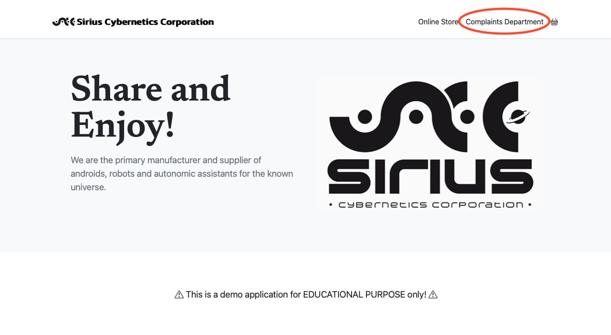
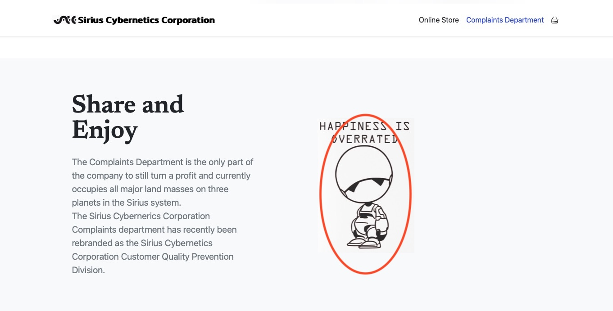
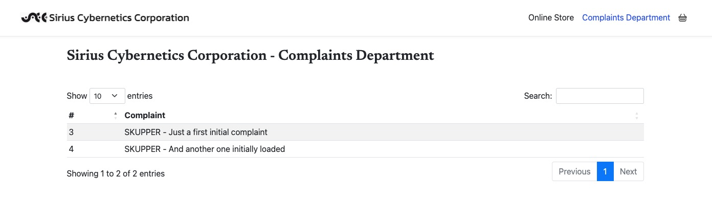

# Cross-Cluster networking Demo with Red Hat Service Interconnect (Skupper)
As the base environment we will use again an environment from the Red Hat demo lab. 

To create the environment, use this template: 
https://catalog.demo.redhat.com/catalog?search=skupper&item=babylon-catalog-prod%2Fsandboxes-gpte.ocp4-service-interconnect.prod

But again, let's briefly talk about how Skupper works.

## Skupper - a primer
Skupper creates a service network, linking services together across hybrid cloud (Layer 7). It is secured using mTLS and supports smart routing and dynamic load balancing.

The main component is the Skupper router, a high-performance and lightweight AMQP message router, which must be installed on any environment (cluster and/or VM's). Unlike Submariner, it does not simply create a VPN, but routes each service connection separately.

  

Red Hat Service Interconnect (Skupper) allows legacy or “never-migrate applications to continue running independently in their original environments while new web-tier applications are deployed in the cloud. To the cloud-native apps running in the cloud, these “legacy” apps appear to be cloud-native apps as well.

There is a good article on how to connect a frontend on OpenShift with a legacy backend here:
https://developers.redhat.com/learn/connect-your-services-across-different-environments-using-red-hat-service-interconnect

## Hybrid scenario(s) - adapt the existing application deployments
Again, let's change the existing application deployments (full deployments) to match our needs.

Our scenario will have the following architecture:

  

As you can see, the primary database will reside in a legacy VM (STEP 1), the secondary database as a fallback as a containerized database in a second OpenShift cluster (STEP 2).

#### Create SCCstore database on the VM
The demo environment already contains a PSQL instance (portal-database) running in a Podman container on the Datacenter VM. But it's missing the sccstore database and user. Let's change this:

Connect to the Datacenter VM with the lab-user and the respective password (check the demo tutorial for the credential details):

    ssh lab-user@bastion.XXX.XXXX.opentlc.com

Then:

    podman exec -it portal-database /bin/bash

Within the container, connect to the database instance:

    psql -h localhost
Then:

    postgres=# create user sccstore with password 'sccstore';
    postgres=# create database sccstore;
    postgres=# GRANT ALL PRIVILEGES ON DATABASE sccstore to sccstore;
    postgres=# \connect sccstore
    You are now connected to database "sccstore" as user "postgres".
    sccstore=# create table complaints (compl_id SERIAL PRIMARY KEY, complaint VARCHAR (255) NOT NULL);
    sccstore=# insert into complaints (complaint) values ('SKUPPER - Just a first initial complaint');
    sccstore=# insert into complaints (complaint) values ('SKUPPER - And another one initially loaded');
    sccstore=# GRANT ALL PRIVILEGES ON table complaints to sccstore;

Ok, this should get the database in the required state.

#### Install the appropriate Skupper binary
The VM (Datacenter) containing the database (as a podman container) is lacking the appropriate version of Skupper (!!). We can easily fix this by installing the most recent version:

    curl https://skupper.io/install.sh | sh

Then add the path to the $PATH variable:

    export PATH=~/.local/bin/:$PATH

#### Install the demo application
We will use the aws namespace of the demo-environment. 

> [!WARNING] 
> Also, the demo-application requires **Red Hat OpenShift Serverless** to be installed! Don't forget that.

    oc project aws
    oc apply -k kustomize/overlays/dev

Change the ConfigMap `sccstore-ui-spring-config` from:

    { "sccstore.complaintsBackend": "http://sccstore-qcomplaints.sccstore-dev.svc" }
to:

    { "sccstore.complaintsBackend": "http://sccstore-qcomplaints.aws.svc" }

You can test the application now, still connected to the local database running in the same namespace.

Once done, remove the local database:

    oc delete -f kustomize/overlays/dev/db.yaml

And change the database-service backend config in the `qcomplaints` component by changing the `sccstore-qcomplaints-config` ConfigMap from:

    SCC_DB_HOST = pg-service
to:

    SCC_DB_HOST = database

That will be the name of the Skupper service used!

#### Skupper setup
Let's focus on Skupper now... follow the tutorial.

On our local machine, connect to the OpenShift cluster running the SCCstore demo and initialize Skupper:

    oc project aws
    skupper init --enable-console --enable-flow-collector --console-auth unsecured

Back on the Datacenter VM:

    export SKUPPER_PLATFORM=podman
    skupper switch
    skupper init --ingress none

Verify with `skupper status`, it should say you are connected to 1 other site.

Back on the local machine, create a token to Skupper on OpenShift:

    oc project aws
    skupper token create secret_aws_vm.token

Copy the content of the file `secret_aws_vm.token` and write it into the same file on the Datacenter VM! On that VM do:

    skupper link create secret_aws_vm.token --name aws-to-vm

Check with `skupper link status`, it should say `connected`!!

Then expose the database service:

    skupper expose host host.containers.internal --address database --port 5432

Back on the local machine, create a respective service on OpenShift:

    oc project aws
    skupper service create database 5432

## Run the Demo
When you now run the demo application, it should show the records from the remote database via Skupper!

  

  

  

