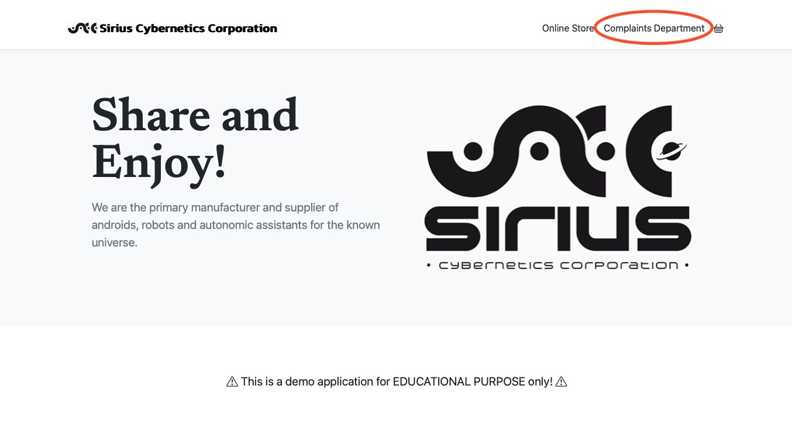
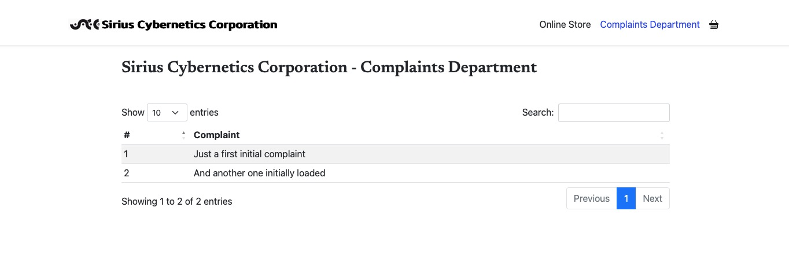

# Cross-Cluster networking Demo with Submariner
As mentioned before, the used lab environment already includes an ACM hub-cluster and 2 workload-clusters. Submariner is already installed and configured.

To create the environment, use this template: 
https://catalog.demo.redhat.com/catalog?search=submariner&item=babylon-catalog-prod%2Fsandboxes-gpte.dr-cloud-cluster-binder.prod

Little we need to do here, however, for clarity's sake, let me shortly describe how Submariner works.

## Submariner - a primer
Submariner provides cross-cluster network infrastructure for OpenShift. It is integrated with and supported as part of Red Hat Advanced Cluster Management for Kubernetes. However, you do not necessarily need RH ACM, but it's much easier.

Submariner connects multiple Kubernetes clusters in a way that flattens the networks between the connected clusters (Layer 3 connectivity), and enables IP reachability between Pods and Services. Submariner also provides service discovery capabilities (services need to be 'exported').

This said, the most important components of Submariner are:
- The gateway - typically running on the hub-cluster
- The agents - running on each workload-cluster
- the registry - same location as the gateway, on the hub-cluster

Installation of Submariner is best done by using the respective operator from the Operator Hub (on the hub-cluster)! And subsequently registering the workload-clusters.

There is a good article about this here: 
https://www.redhat.com/en/blog/submariner-acm-add-on
or here:
https://piotrminkowski.com/2024/01/15/openshift-multicluster-with-advanced-cluster-management-for-kubernetes-and-submariner/

However, as said before, our demo environment already contains a properly setup Submariner configuration.

  

## Dual-Cluster Scenario - adapt the existing application deployments
Now, let's change the existing application deployments (full deployments on both clusters) since we need only part of application on each cluster and will then wire the frontend to the backend via Submariner.

What we need is the following architecture:

  

This said, create a namespace **in each of the workload-clusters** and deploy the application. From the SCCstore folder do:

    oc new-project sccstore-dev
    oc apply -k kustomize/overlays/dev

As we want to have a distributed application, we will delete the PostreSQL database from Cluster 1 and the UI and Quarkus serverless middle-tier component from Cluster 2.

This can be easily done... From the SCCstore folder do:

On Cluster 1:

    oc delete -f kustomize/overlays/dev/db.yaml

On Cluster 2:

    oc delete -f kustomize/base/ui.yaml
    oc delete -f kustomize/base/qcomplaints.yaml

## Run the Demo
That's it. If you now try to read the data from the database in the UI:

  

  

As there is no connectivity yet configured from the qcomplaints component in Cluster 1 to the database in Cluster 2, **you will get an empty list and see errors in the log**.

Wiring the services across clusters is now even more simple! 

Back in our directory here, run on Cluster 2 (where the database is):

    oc apply -f service-export.yaml

This will publish the database service to Submariner so that the discovery fro Cluster 1 will work.

Then on Cluster 1 (where the UI is):

    oc apply -f qcomplaints-config.yaml

This will change the service location of the database to the default 
    
    pg-service
to

    pg-service.sccstore-dev.svc.clusterset.local

Run the application again and... tataaa!... the database now is reachable.

  

